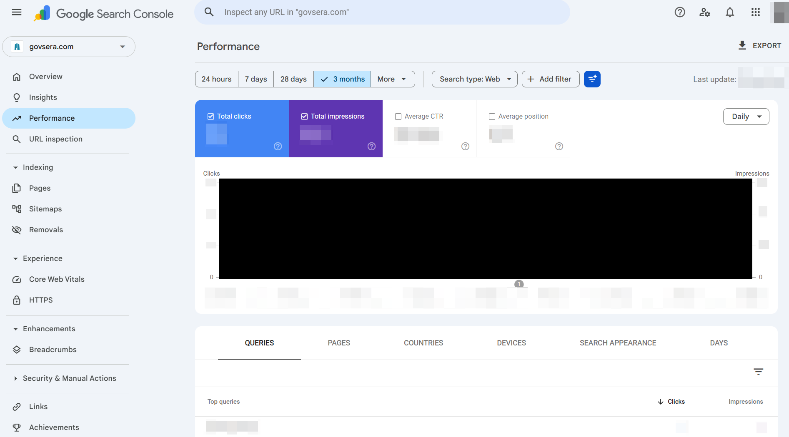
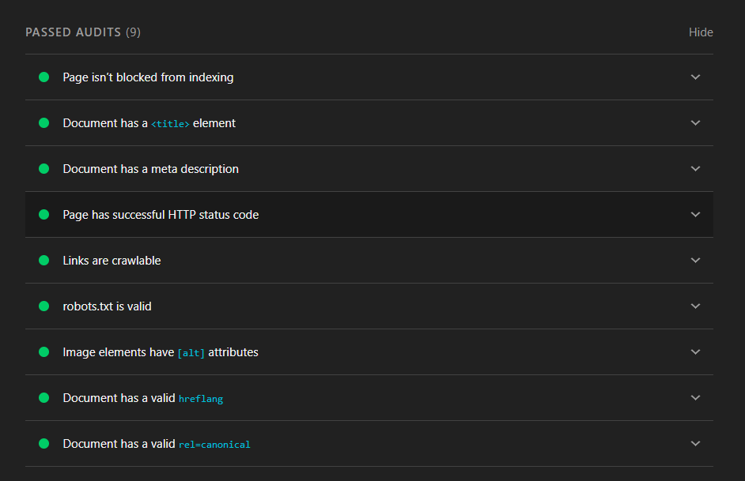
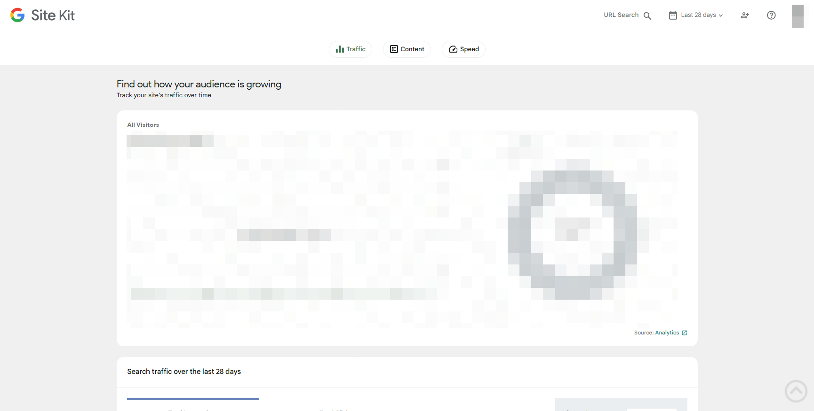
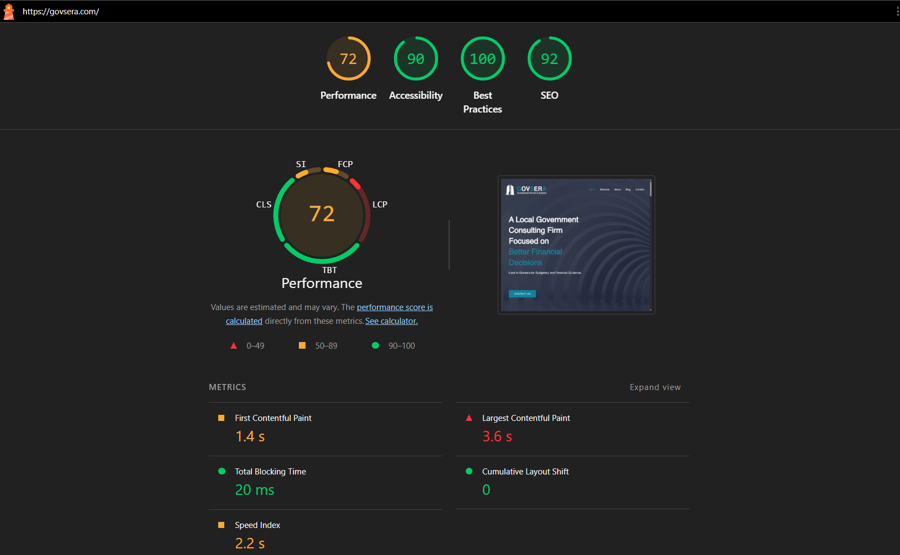

<h1>SEO & Analytics Setup</h1>

>  🔒 Some information has been redacted to protect confidentiality and security.

After the main website structure was in place, the next step was to support how the site would be discovered, measured, and reviewed after launch. This section covers the setup and checks used to connect the website with Google’s search and analytics tools, review page visibility, and evaluate technical performance.

<h2>Search Console & Indexing</h2>

Google Search Console was connected to monitor indexing, inspect important pages, request indexing, and review how Google was crawling the site.

<h2>Page-Level SEO</h2>

Page-level SEO was reviewed, including titles, meta descriptions, branded search visibility, and how key pages appeared in search results.

<h2>Analytics Tracking</h2>

Google Analytics was added along with a plug-in with in wordpress to create a basic tracking foundation for website traffic, user activity, and future performance review.

<h2>Lighthouse Performance Review</h2>

A Lighthouse report was used to review the website’s performance, accessibility, best practices, and SEO scores. Improvements are an ongoing process, with updates made continuously over time.

> Lighthouse reports are publicly accessible and do not require redaction.

<h2>Key Work Completed</h2>
<ul>
<li>Connected Google Search Console</li>
<li>Requested page indexing</li>
<li>Reviewed crawl and indexing issues</li>
<li>Checked redirect errors</li>
<li>Reviewed duplicate content warnings</li>
<li>Checked canonical URL concerns</li>
<li>Reviewed page titles and meta descriptions</li>
<li>Set up Google Analytics</li>
<li>Reviewed Lighthouse performance report</li>
<li>Checked accessibility, best practices, and SEO scores</li>
<li>Monitored branded search visibility</li>
</ul>

<h2>Key Takeaway</h2>
This work helped move the website beyond a basic launch and into a more measurable, search-ready state. The focus was not just on making the site look complete, but on making sure it could be found by Google, reviewed for technical issues, tracked through analytics, and improved based on real performance data.

[Return to Home](https://github.com/JorgeFSantillan)
